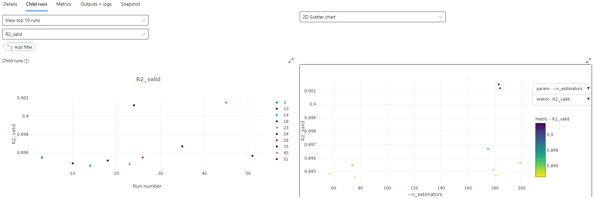
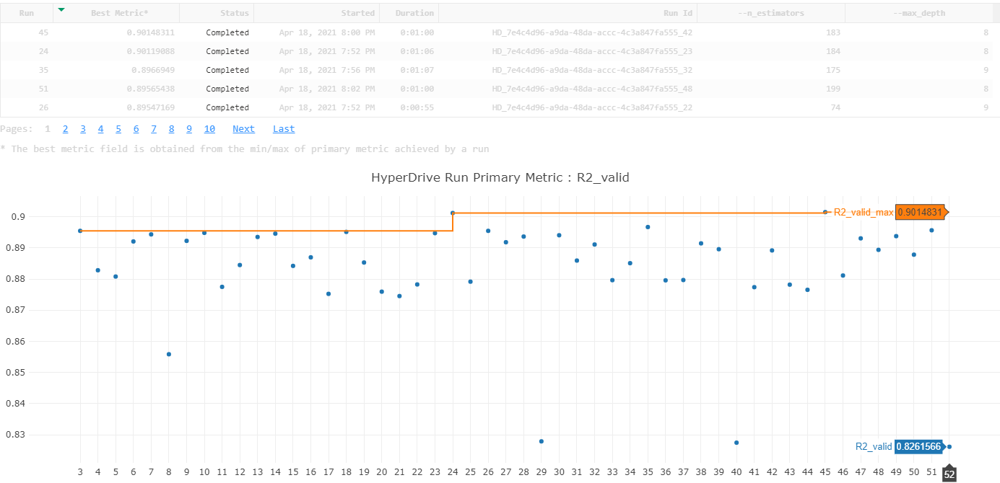

# Energy demand forecasting

Energy is vital for the sustainable development of any nation – be it social, economic, or environmental. In the past decade, energy consumption has increased exponentially globally. Energy management is crucial for the future economic prosperity and environmental security. Energy is linked to industrial production, agricultural output, health, access to water, population, education, quality of life, etc.

The aim of this project is to develop an ML framework to forecast eletric load by utilising Azure HyperDrive and Azure AutoML. Electric load forecasting refers to forecasting electricity demand and energy a few minutes to a few decades ahead. As a fundamental business problem in the utility industry, load forecasting has extensive applications, such as power systems operations and planning, customer services, revenue management, energy trading, and so forth.

**Caveat**: The aim of this project was to practice developing ML pipelines using Azure HyperDrive and Azure AutoML, not to achieve the best accuracy nor applying proper data science methodology to problem solving. Therefore, minimal effort was invested in data ETL, EDA, evaluation, etc. which are major components of a data science projects.

## 1. Dataset

### 1.1. Overview

The dataset was taken from Kaggle: [Energy Forecasting for Power Industry Dataset](https://www.kaggle.com/palaksood97/energy-forecasting-for-power-industry-dataset). It contains historical demand and weather data for Kuwait from 2004 to 2006. The dataset schema is as follows:

| Column              | Unit           | Resolution | Target variable |
| ------------------- | -------------- | ---------- | --------------- |
| Electricity load    | MwH            | 30 min     | Yes             |
| Average temperature | degree Celcius | Daily      | No              |
| Average Humidity    | g/m3           | Daily      | No              |
| Holiday index       | N/A            | Daily      | No              |
| Sunrise time        | N/A            | Daily      | No              |
| Sunset time         | N/A            | Daily      | No              |

The dataset is already split into a training and validation set which are described as follows:

| Attribute         | Training set | Validation set |
| ----------------- | ------------ | -------------- |
| Start date        | 2004-01-01   | 2006-10-01     |
| End date          | 2006-09-30   | 2006-24-11     |
| Number of records | 48190        | 2594           |

### 1.2. Task

The aim of this project is to train a machine learning model to forecast eletric load by 2 approaches. The first is manual model development and feature engineering, and hyperparameter tuning using Azure HyperDrive. The second is to automatically perform the above steps using Azure AutoML. The best model obtained by the 2 approaches will be registered to Azure Machine Learning and deployed as a web service, which allows applications to obtain prediction by sending HTTP POST requests to the webservice's endpoint.

### 1.3. Access

The dataset was originally stored in 2 csv files: `training.csv` and `validation.csv`. I uploaded them into the Azure ML's workspace datastore, which are then registered as 2 datasets. This allows them to be internal to Azure machine learning and loaded during remote model training sessions.

## 2. Automated ML

### 2.1. Overview

The AutoML pipeline was developed using the following settings:

```python
AutoMLConfig(
    compute_target=compute_target,
    task='forecasting',
    training_data=data_train,
    validation_data=data_valid,
    label_column_name='TOTAL Load',
    time_column_name='DATE',
    enable_early_stopping=True,
    featurization='auto',
    debug_log = 'automl_errors.log',
    experiment_timeout_minutes=15,
    max_concurrent_iterations=10,
    primary_metric='r2_score',
    forecast_horizon=48,
    target_lags=48
)
```

Explanation:

- `compute_target`: `STANDARD_DS12_V2`: 4vCPU, 28GiB Memory with 6 nodes. This is an average-sized VM for training multiple ML models at the same time.
- `task='forecasting'`: This is because we're interested in predicting future electricity load, instead of simply inferencing electricity load based on the available variables like humidity, temperature.
- `enable_early_stopping=True`: This is to reduce the likelihood of overfitting.
- `featurization='auto'`: This is the main strength of AutoML. We'll let it carry out feature engineering automatically
- `experiment_timeout_minutes=15`: Mainly because I was pressed on time hence can't afford for the experiment to run too long. This is added on top of the preparation steps which already took ~45 minutes, increasing the experiment run time to ~1hr.
- `primary_metric='r2_score'`: While `RMSE` would do just fine as a primary metric, R2 score is just easier to analyse by seeing how close it is to 1.
- `forecast_horizon=48, target_lags=48`: We're interested in predicting the load for the next day.

### 2.2. Results

The best model generated by AutoML is a SoftVottingRegressor, which is an ensemble of 4 models: 3 `XGBoostRegressor`s, and 1 `ElasticNet`.


Details of the estimators are as follows:

```python
PreFittedSoftVotingRegressor(
    estimators=[('0',
                Pipeline(memory=None,
                        steps=[('sparsenormalizer',
                                <azureml.automl.runtime.shared.model_wrappers.SparseNormalizer object at 0x000001A2C2D61F48>),
                                ('xgboostregressor',
                                XGBoostRegressor(base_score=0.5,
                                                booster='gbtree',
                                                colsample_bylevel=1,
                                                colsample_bynode=1,
                                                colsample_bytree=0.7,
                                                eta=0.3,
                                                gamma=0,
                                                grow_policy='lossgui...
                                <azureml.automl.runtime.shared.model_wrappers.StandardScalerWrapper object at 0x000001A2C1046BC8>),
                                ('elasticnet',
                                ElasticNet(alpha=0.05357894736842105,
                                            copy_X=True,
                                            fit_intercept=True,
                                            l1_ratio=0.6873684210526316,
                                            max_iter=1000,
                                            normalize=False,
                                            positive=False,
                                            precompute=False,
                                            random_state=None,
                                            selection='cyclic',
                                            tol=0.0001,
                                            warm_start=False))],
                        verbose=False))],
    weights=[0.7142857142857143, 0.14285714285714285,
            0.07142857142857142,
            0.07142857142857142]
)
```

Below is the performance of the best model generated by AutoML::

| Metric                                   | Value     |
| ---------------------------------------- | --------- |
| `root_mean_squared_error`                | 43921.248 |
| `median_absolute_error`                  | 21911.096 |
| `normalized_root_mean_squared_log_error` | 0.053     |
| `explained_variance`                     | 0.751     |
| `mean_absolute_percentage_error`         | 12.011    |
| `normalized_median_absolute_error`       | 0.047     |
| `normalized_root_mean_squared_error`     | 0.095     |
| `r2_score`                               | 0.750     |
| `normalized_mean_absolute_error`         | 0.065     |
| `mean_absolute_error`                    | 30423.287 |
| `spearman_correlation`                   | 0.864     |
| `root_mean_squared_log_error`            | 0.172     |

Model performance over training runs is as follows:


Regarding the primary metric, AutoML managed to achieve a R2 score of 0.75, which was inferior to what achieved by the HyperDrive run. I believe the main cause was that it couldn't make sense of the `SUNRISE` and `SUNSET` columns in the dataset, therefore they weren't utilised (or not utilised correctly).

As a result, we can further improve the model by combining the `SUNRISE` and `SUNSET` columns into 1 that tells whether the sun has set or not, like what was done in the HyperDrive pipeline. In addition, longer training time could help finding a better model, as the current time limit (15 minutes) caused a lot of model trainings to terminate early.

## 3. Hyperparameter Tuning

### 3.1. Overview

#### Feature engineering

Before perform model training, I spent a bit of time on feature engineering:

- Combined the `SUNRISE` and `SUNSET` columns into 1 that tells whether the sun has set or not for each timestamp.
- Extract time-based features from the timestamps, such as day of the week, hour, month, weekend or not
- Created a 24-hour lag feature for the target variable (`Total Load`)

#### Model selection

In this project, I selected RandomForestRegressor as the predictor. This is mainly because it's simple to configure and is known to achieve decent performance.

#### Hyperparameter tuning

The selected hyperparameters to be tuned are `n_estimators`, which is the number of trees in the forest, and `max_depth`, which is the maximum depth of each tree. I decided to limit to only these 2 hyperparameters because they are the most important ones, and due to time restriction. The search space of each hyperparameter, defined following some rule of thumbs, is as follows:

| Hyperparameter | Range     | Type    |
| -------------- | --------- | ------- |
| `n_estimators` | (50, 200) | Integer |
| `max_depth`    | (3, 21)   | Integer |

Below is the full configuration for HyperDrive hyperparameter optimisation:

```python
# Hyperparameter sampling
param_sampler = BayesianParameterSampling({
    "--n_estimators": choice(range(50, 200)),
    "--max_depth": choice(range(3, 21))
    })

# Create estimator
est = SKLearn(
    source_directory='./src/',
    entry_script='train.py',
    compute_target=cluster_name
)

# Create a HyperDriveConfig using the estimator, hyperparameter sampler, and policy.
hyperdrive_config = HyperDriveConfig(
    estimator=est,
    hyperparameter_sampling=param_sampler,
    primary_metric_name='R2_valid',
    primary_metric_goal=PrimaryMetricGoal.MAXIMIZE,
    max_total_runs=50,
    max_concurrent_runs=4,
    policy=None
)
```

Explanation of the key arguments:

- `hyperparameter_sampling`: I selected `BayesianParameterSampling` as the hyperparameter sampling algorithm because it is proven to be efficient in searching a large parameter space when the number of searches is limited (50 in this project).
- `estimator`: `SKLearn` estimator class allows specifying a training script that is used for each model training run. In this settings, the choice of hyperparameters are given to the script as arguments, which are then parsed and passed into the ML model, which is the `RandomForestRegressor` class in this case.
- `primary_metric_name='R2_valid'`: The selected primary metric is R2 on the validation dataset, which is the same as the one selected to optimise the AML pipeline. This is because it is easy to analyse, the close it is to 1, the better the prediction.
- `max_total_runs=50`: I decided to limit the `maximum_total_runs` to 50 due to time constraint and there are only 2 hyperparameters to tune.
- `policy=None`: The `policy` argument, which is for specifying a stopping policy, was set to `None` because there is currently no stopping policy that supports `BayesianParameterSampling` parameter sampler.

### 3.2. Results

The best combination of the selected tuned hyperparameters is `n_estimators` = 183 and `max_depth` = 8.



This results in the following Random Forest model:

```python
RandomForestRegressor(
    n_estimators=183,
    criterion='mse',
    max_depth=8,
    min_samples_split=2,
    min_samples_leaf=1,
    min_weight_fraction_leaf=0.0,
    max_features='auto',
    max_leaf_nodes=None,
    min_impurity_decrease=0.0,
    min_impurity_split=None,
    bootstrap=True,
    oob_score=False,
    n_jobs=None,
    random_state=None,
    verbose=0,
    warm_start=False,
    ccp_alpha=0.0,
    max_samples=None
)
```


This model achieved an R2 score of 0.9 on the validation set and 0.89 on the training set. Since the R2 performance on the 2 sets are nearly equal, this suggests that the model doesn't suffer from overfitting.

As discussed above, this performance is much better than what achieved by the AutoML pipeline, and the main cause was that in AutoML, no feature engineering was done to the `SUNRISE` and `SUNSET` columns in the dataset while the opposite is true for this run.

Nevertheless, I believe this approach can be further improved by looking at different time lag windows and hyperparameter tuning on a larger hyperparameter space.

Model performance over training runs is as follows:



## 4. Model Deployment

The model was deployed using the Azure ML Python SDK. The steps were:

- Create a conda specification file listing the required libraries
- Create an environment from the conda specification file `conda_env.yaml`
- Create an entry script for prediction `score.py`
- Deploy the model to an ACI Instance with 1 CPU core and 1Gb Memory
- Enable application insights for monitoring


To consume the endpoint, one can simply send the input variables as payload to the endpoint and receive the prediction in json format. Example as follows:

```python
import json
import requests

input_json = json.dumps(json.load(open('./test_payload.json')))
response = requests.post(service.scoring_uri, input_json, headers={'Content-Type':'application/json'})

prediction = json.loads(response.content)

print(prediction)
```

## 5. Screen Recording

The following video demonstrates the working model and how to consume the model's endpoint.

<https://youtu.be/JNo1KyjjZdE>
